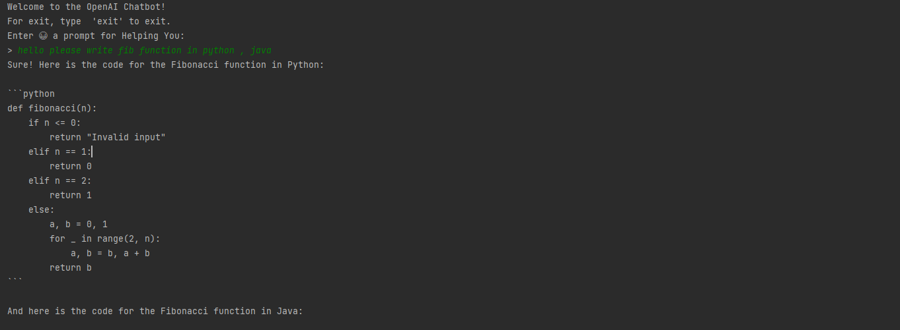

# OpenAI Chatbot Project

Welcome to the OpenAI Chatbot project! This simple console-based chatbot uses OpenAI's GPT-3.5-turbo model to assist you with various prompts. You can interact with the chatbot by entering prompts, and it will respond accordingly.

## Getting Started

### Prerequisites

- Python 3.x installed
- OpenAI API key (Sign up at [OpenAI](https://platform.openai.com/signup/) if you don't have one)

### Installation

1. Clone the repository:

   ```bash
   git clone https://github.com/MarioNageh/Chat-Gpt-Python.git
    ```
   
2. Create a virtual environment:
    ```bash
   python -m venv venv
   ```
3. Activate the virtual environment:
    ```bash
   source venv/bin/activate
   ```
4. Install the required packages:
    ```bash
   pip install -r requirements.txt
   ```
5. Create a `.env` file in the root directory of the project and add your OpenAI API key:
    ```bash
    OPENAI_API_KEY=your-api-key
    OPENAI_API_MODEL=MODEL_NAME
    ```

6. Run the program:
    ```bash
   python main.py
   ```
## Usage
See Pictures in the folder "Pictures" for examples of the chatbot in action.


